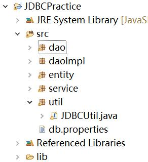

# JDBC 封装工具类(oracle 数据库)

## 版本1（简单连接数据库执行sql语句）
### 目录结构
#### 
### 在开始之前我们先回顾一下jdbc连接数据库的6个步骤
	1. 加载数据库驱动到jvm虚拟机，通过 Class类的静态方法.forName()
		+ 例如
			` try{//加载MySql的驱动类    
         Class.forName("com.mysql.jdbc.Driver") ;    
    }catch(ClassNotFoundException e){    
         System.out.println("找不到驱动程序类 ，加载驱动失败！");    
         e.printStackTrace() ;    
    }    `
